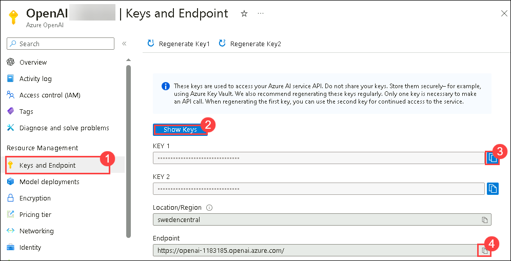
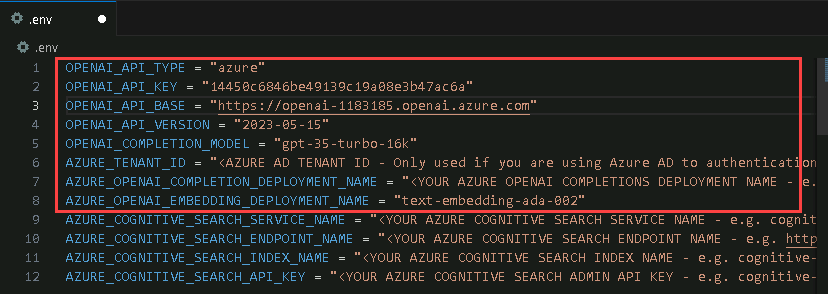

# Exercise 4A: Interacting with Azure OpenAI APIs with Python

In this exercise, you will unleash the potential of Azure OpenAI APIs in Python projects, tapping into advanced language processing and machine learning

## Lab Scenario

Contoso seeks to set up the necessary configurations for integrating AI into their Python projects. In this exercise, we will learn how to utilize  the OpenAI Python library for enhanced interaction with Azure OpenAI API. 

## Lab objectives

In this lab, you will perform the following:

- Fetch the OpenAI Key and Endpoint Values
- Setup configuration for Integrating AI
- Interact with Azure OpenAI API service endpoint

## Architecture Diagram

## Task 1: Fetch the OpenAI Key and Endpoint Values

1. Navigate to the  [Azure portal](http://portal.azure.com/), search and select **Azure OpenAI**, from the **Azure AI Services | Azure OpenAI pane**, select the **OpenAI-<inject key="Deployment ID" enableCopy="false"></inject>**.

1. Now select **Keys and Endpoints** **(1)** under Resource Management and click on **Show Keys** **(2)**. Copy the **KEY 1** **(3)** and **Endpoint** **(4)**, and store them in a text file for later use.

   

## Task 2: Setup configuration for Integrating AI

1. Open **Visual Studio Code** from the Lab VM desktop by double-clicking on it.

   

1. In Visual Studio Code from menu bar select **File(1)>open folder(2)**.   

   

1. Within **File Explorer**, navigate to **C:\LabFiles** select **intro-to-intelligent-apps-main**(1) click on **Select folder(2)**

   

1. In **Visual Studio Code**, click on **Yes, I trust the authors** when **Do you trust the authors of the files in this folder?** window prompted.

   

1. From the left pane,click on **.env**, replace the values and save the file by pressing **ctrl + s**.

   | **Variables**                            | **Values**                                                                              |
   | ---------------------------------------- |-----------------------------------------------------------------------------------------|
   | OPENAI_API_TYPE                          |  **azure**                                                                              |
   | OPENAI_API_KEY                           | Replace the value with the **AZURE OPENAI API KEY** which you noted in Task 1 step 2    |
   | OPENAI_API_BASE                          | Replace the value with the **AZURE OPENAI ENDPOINT** which you noted in Task 1 step 2   |
   | OPENAI_COMPLETION_MODEL                  | **gpt-35-turbo-16k**                                                                        |
   | AZURE_OPENAI_COMPLETION_DEPLOYMENT_NAME  | **gpt-35-turbo-16k**                                                                        |
   | AZURE_OPENAI_EMBEDDING_DEPLOYMENT_NAME   | **text-embedding-ada-002**                                                              |

   
   > **Note:** Please make sure to remove **/** From the **OPENAI_API_BASE**.
  
> **Congratulations** on completing the task! Now, it's time to validate it. Here are the steps:
  > - Navigate to the Lab Validation tab, from the upper right corner in the lab guide section.
  > - Hit the Validate button for the corresponding task. If you receive a success message, you can proceed to the next task. 
  > - If not, carefully read the error message and retry the step, following the instructions in the lab guide.
  > - If you need any assistance, please contact us at labs-support@spektrasystems.com.

### Task 3: Azure OpenAI API

In this Task, we'll walk through showing how to interact with an Azure OpenAI API service endpoint. This will not likely be the best option for most scenarios, but it highlights what a direct call to the underlying rest-based API looks like and will give you an appreciation of what's going on behind the scenes when you use the orchestrators in the other exercises.

1. In the Visual Studio Code navigate to **intro-to-intelligent-apps-main/labs/02-integrating-ai/01-AzureOpenAIAPI** folder and select **azureopenaiapi.ipynb**

   

1. From the right corner click on **Select Kernal** and on the Choose a Kernel source pop-up, select **Python Environment**. This will initiate the installation of the extension.

   

1. Next, on the Select a **Python Environment** pop-up, select avaiable **Python 3.10.0** env. This will set the Python Environment.

   

1. **Execute the notebook cell by cell** (using either Ctrl + Enter to stay on the same cell or Shift + Enter to advance to the next cell) and observe the **results of each cell** execution.
  
   > **Note**: Make sure **Python Environmen** is in ready State, If not please wait for 15 to 20 seconds.

      

   > **Note**: If any pop-up **Running cells with 'c:\Python312\python.exe' requires the ipykernel package**, click on **Install**.

      

### Task 4: OpenAI Packages

In this task, we'll show how to interact with the Azure OpenAI API using the OpenAI Python library. This will provide some insight into the configuration and setup that is needed to use one of these higher-level abstraction frameworks.

1. In the Visual Studio Code navigate to **intro-to-intelligent-apps-main/labs/02-integrating-ai/02-OpenAIPackages** folder and select **openai.ipynb**

   

1. From the right corner click on **select Kernal** and on the Choose a Kernel source pop-up, select available **Python 3.10.0** env. This will set the Python Environment.

   

1. **Execute the notebook cell by cell** (using either Ctrl + Enter to stay on the same cell or Shift + Enter to advance to the next cell) and observe the **results of each cell** execution.
  
   > **Note**: Make sure **Python Environmen** is in ready State, If not please wait for 15 to 20 seconds.

      

## Review

In this lab, you have provisioned an Azure OpenAI resource, deployed a model, and set up configuration for integrating AI to run notebooks in Azure OpenAI API, OpenAI Packages.

## Proceed to Exercise 4b
