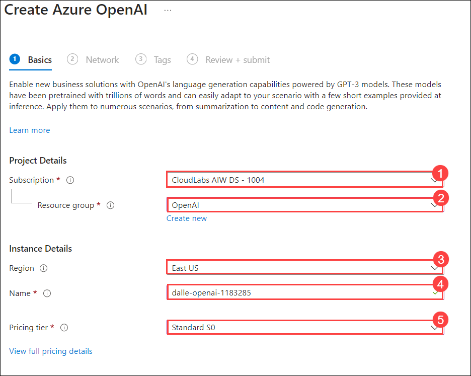
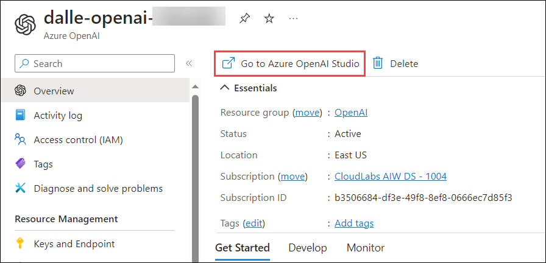

# Exercise 4c: Generate images with a DALL-E model
In this exercise, you will explore the potential of image generation with Azure OpenAI Service's DALL-E model. Generate original images using natural language prompts through the DALL-E Playground and REST API, enhancing your applications with AI-driven content creation.

## Lab scenario
Contoso aims to explore the potential of generating original images by submitting natural language prompts to the DALL-E model.This lab empowers Contoso to integrate advanced image-generation capabilities into their applications, allowing them to explore creative and practical use cases for AI-driven content creation.

## Lab objectives
In this lab, you will complete the following :

- Explore image generation in the DALL-E playground
- Use the REST API to generate images
- Prepare the app environment
- Configure your application
- View application code
- Run the app

## Architecture Diagram

  

## Task 1: Create an Azure OpenAI Resource

1. In the **Azure portal**, search for **OpenAI** and select **Azure OpenAI**.

   

2. On **Azure AI Services | Azure OpenAI** blade, click on **Create**.

   

3. Create an **Azure OpenAI** resource with the following settings:
   
    - **Subscription**: Default - Pre-assigned subscription. (1)
    - **Resource group**: OpenAI (2)
    - **Region**: East US
    - **Name**: dalle-openai-<inject key="Deployment ID" enableCopy="false"></inject> (4)
    - **Pricing tier**: Standard S0 (5)
  
      
      
      >**Note:** Kindly select the East US region only as the resources are region-specific.

4. Keep rest as default click on Next thrice and subsequently click on **Create** 
5. Wait for deployment to complete. Then click on  **Go to Resource**.
3. In the Azure OpenAI resource pane, click on **Go to Azure OpenAI Studio** it will navigate to **Azure AI Studio**.

   

Congratulations on completing the task! Now, it's time to validate it. Here are the steps:

Navigate to the Lab Validation tab, from the upper right corner in the lab guide section.
Hit the Validate button for the corresponding task. If you receive a success message, you can proceed to the next task.
If not, carefully read the error message and retry the step, following the instructions in the lab guide.
If you need any assistance, please contact us at labs-support@spektrasystems.com.

## Task 2: Explore image generation in the DALL-E playground

You can use the DALL-E playground in **Azure OpenAI Studio** to experiment with image generation.

1. In the **Azure OpenAI Studio** ,from the left navigation pane, select the **DALL-E Playground**.

2. In the **Prompt** box, enter a description of an image you'd like to generate. For example, *An elephant on a skateboard*. Then select **Generate** and view the image that is generated.

    

3. Modify the prompt to provide a more specific description. For example *An elephant on a skateboard in the style of Picasso*. Then generate the new image and review the results.

    

## Task 2: Use the REST API to generate images

The Azure OpenAI service provides a REST API that you can use to submit prompts for content generation - including images generated by a DALL-E model.

### Task 2.1: Prepare the app environment

In this exercise, you'll use a simple Python or Microsoft C# app to generate images by calling the REST API. You'll run the code in the cloud shell console interface in the Azure portal.

1. In the [Azure portal](https://portal.azure.com?azure-portal=true), select the **[>_]** (*Cloud Shell*) button at the top of the page to the right of the search box. A Cloud Shell pane will open at the bottom of the portal. 

    

2. Make sure the type of shell indicated on the top left of the Cloud Shell pane is switched to *Bash*. If it's *PowerShell*, switch to *Bash* by using the drop-down menu.

3. Once the terminal starts, enter the following command to download the application code you are going to work with.

    ```bash
   rm -r azure-openai -f
   git clone https://github.com/MicrosoftLearning/mslearn-openai azure-openai
    ```

    The files are downloaded to a folder named **azure-openai**. Applications for both C# and Python have been provided. Both apps feature the same functionality.

4. Navigate to the folder for the language you want to use by running the appropriate command.

    **Python**

    ```bash
   cd azure-openai/Labfiles/05-image-generation/Python
    ```

    **C#**

    ```bash
   cd azure-openai/Labfiles/05-image-generation/CSharp
    ```

5. Use the following command to open the built-in code editor and see the code files you will be working with.

    ```bash
   code .
    ```

### Task 2.2: Configure your application

The application uses a configuration file to store the details needed to connect to your Azure OpenAI service account.

1. In the code editor, select the configuration file for your app - depending on your language preference.

    - C#: `appsettings.json`
    - Python: `.env`
    
2. Update the configuration values to include the **Endpoint** and **Key1** for your Azure OpenAI service. Then save the file by right-clicking the file from the left pane.

     >**Note:** Copy the Endpoint and Key value for the **dalle-openai-<inject key="Deployment ID" enableCopy="false"></inject>** from the Azure portal.
     
     > **Tip**: You can adjust the split at the top of the cloud shell pane to see the Azure portal, and get the endpoint and key values from the **Keys and Endpoint** page for your Azure OpenAI service.

4. If you are using **Python**, you'll also need to install the **python-dotenv** package used to read the configuration file. In the console prompt pane, ensure the current folder is **~/azure-openai/Labfiles/05-image-generation/Python**. Then enter this command:

    ```bash
   pip install python-dotenv
    ```

### Task 2.3: View application code

Now you're ready to explore the code used to call the REST API and generate an image.

1. In the code editor pane, select the main code file for your application:

    - C#: `Program.cs`
    - Python: `generate-image.py`

2. Review the code that the file contains, noting the following key features:
    - The code makes https requests to the endpoint for your service, including the key for your service in the header. Both of these values are obtained from the configuration file.
    - The process consists of <u>two</u> REST requests: One to initiate the image-generation request, and another to retrieve the results.
    The initial request includes the following data:
        - The user-provided prompt that describes the image to be generated
        - The number of images to be generated (in this case, 1)
        - The resolution (size) of the image to be generated.
    - The response header from the initial request includes an **operation-location** value that is used for the subsequent callback to get the results.
    - The code polls the callback URL until the status of the image-generation task is *succeeded*, and then extracts and displays a URL for the generated image.
   

      >**Congratulations** on completing the task! Now, it's time to validate it. Here are the steps:
      > - Navigate to the Lab Validation tab, from the upper right corner in the lab guide section.
      > - Hit the Validate button for the corresponding task. If you receive a success message, you can proceed to the next task. 
      > - If not, carefully read the error message and retry the step, following the instructions in the lab guide.
      > - If you need any assistance, please contact us at labs-support@spektrasystems.com.

## Task 3: Run the app

Now that you've reviewed the code, it's time to run it and generate some images.

1. In the console prompt pane, enter the appropriate command to run your application:

    **Python**

    ```bash
   python generate-image.py
    ```

    **C#**

    ```bash
   dotnet run
    ```

2. When prompted, enter a description for an image. For example, *A giraffe flying a kite*.

3. Wait for the image to be generated - a hyperlink will be displayed in the console pane. Then select the hyperlink to open a new browser tab and review the image that was generated.

4. Close the tab containing the generated image and re-run the app to generate a new image with a different prompt.

## Review

In this lab, you have accomplished the following:
-   Understood the concepts of image generation via the DALL-E model.
-   Implemented image-generation into your applications using this model

### Proceed to Exercise 5
