# Exercise 9A: Semantic Kernal

## Introduction

In the prior, you effectively deployed models within the Azure OpenAI service. Now, in this subsequent challenge, your exploration will focus on Semantic Kernel by running Python/dotnet Jupyter notebooks.

The open-source Semantic Kernel streamlines the amalgamation of AI services, including OpenAI, Azure OpenAI, and Hugging Face, into traditional programming languages like C# and Python.

## Lab objectives

In this lab, you will perform:

- Dynamically generating the prompt using complex rules at runtime
- Writing prompts by editing Python code instead of TXT files.
- Easily creating demos, like this document

## Architecture Diagram

   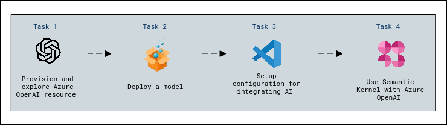

### Task: Setup configuration for Semantic Kernel

1. Open **Visual Studio Code** from the Lab VM desktop by double-clicking on it.

      

3. In Visual Studio Code from menu bar select **File(1)>open folder(2)**.

      

4. Within **File Explorer**, navigate to **C:\LabFiles** select **semantic-kernel-main** click on **Select folder(2).**

      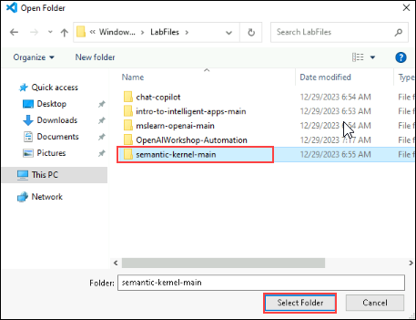

5. In **Visual Studio Code**, click on **Yes, I trust the authors** when **Do you trust the authors of the files in this folder?** window prompted.

     

6. In the Visual Studio Code navigate to **semantic-kernel-main\python\notebooks**

     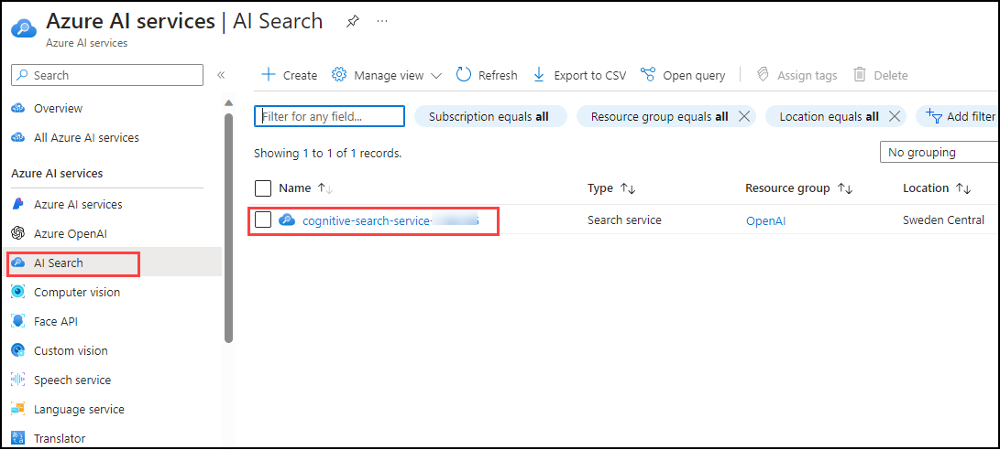

7. Click on **.env.example** file, replace the values and save the file by pressing **ctrl+s** while renaming it as **.env**.

   | **Variables**                            | **Values**                                          |
   | ---------------------------------------- |-----------------------------------------------------|
   | AZURE_OPENAI_DEPLOYMENT_NAME             | Replace the value gpt-35-turbo **Deployment name**  |      
   | AZURE_OPENAI_ENDPOINT                    | Replace the value with the **AZURE OPENAI ENDPOINT**|
   | AZURE_OPENAI_API_KEY                     | Replace the value with the **AZURE OPENAI API KEY** | 
   
### Task: Setup orchestration for Semantic Kernel

1. In the Visual Studio Code navigate to **semantic-kernel-main\python\notebooks** folder and select **00-getting-started.ipynb**.

     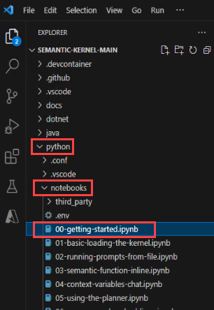

2. From the right corner click on **select Kernal** and on the Choose a Kernel source pop-up, select **available Python 3.10.0** env. This will set the Python Environment.

    

3. **Execute the notebook cell by cell** (using either Ctrl + Enter to stay on the same cell or Shift + Enter to advance to the next cell) and observe the **results of each cell** execution.

      **Note :** Execute the Notebook from **Option 2: using Azure OpenAI** as in above task we have added AZURE OPENAI datas.

      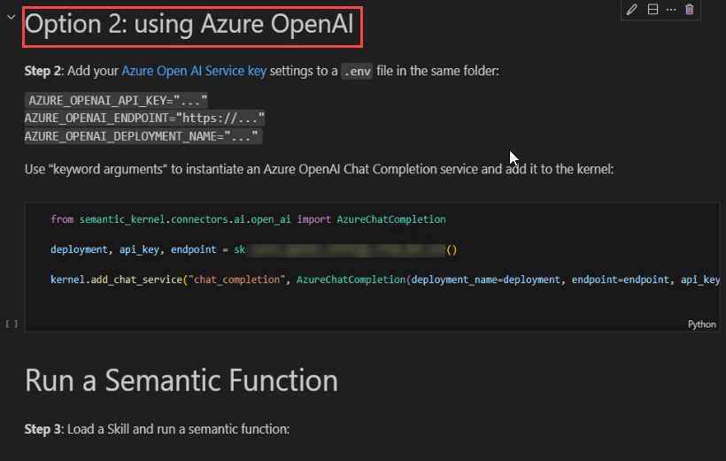 
   
5. In the Visual Studio Code navigate to **semantic-kernel-main\python\notebooks** folder and select **03-semantic-function-inline.ipynb**.

      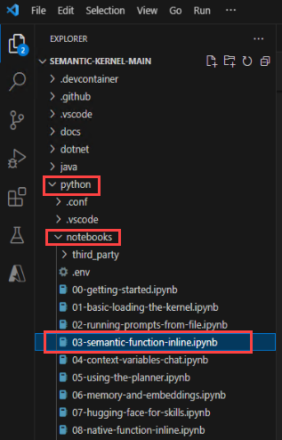 

6. From the right corner click on **select Kernal** and on the Choose a Kernel source pop-up, select **available Python 3.10.0** env. This will set the Python Environment.

     

7. **Execute the notebook cell by cell** (using either Ctrl + Enter to stay on the same cell or Shift + Enter to advance to the next cell) and observe the **results of each cell** execution.
- In **Running Semantic Functions Inline Execution Cell**

    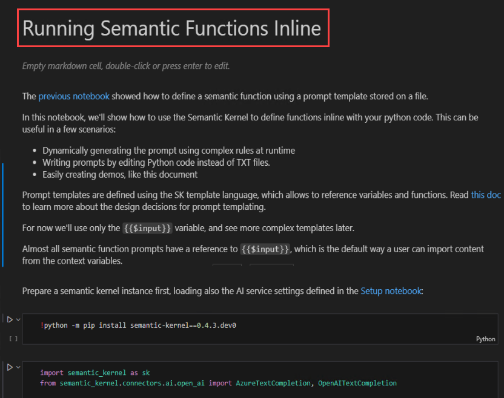
  
- Replace **useAzureOpenAI = False to useAzureOpenAI = True**
- Replace deployemt name with **devinci 002** with deployment
- End point with **AZURE OPENAI ENDPOINT** and Api key with **AZURE OPENAI API KEY**
  
     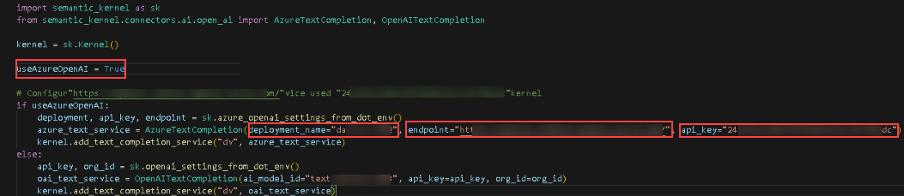
  
- In **ChatCompletion for Semantic Skills Execution Cell**

   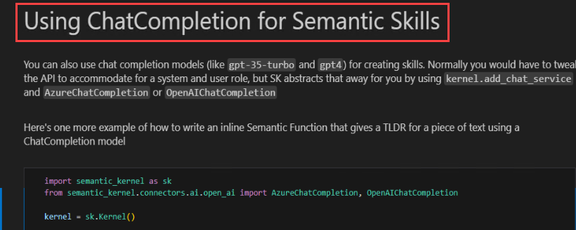
  
- Replace **useAzureOpenAI = False to useAzureOpenAI = True**
- Replace deployemt name with **gpt-35-turbo** with deployment
- End point with **AZURE OPENAI ENDPOINT** and Api key with **AZURE OPENAI API KEY**

    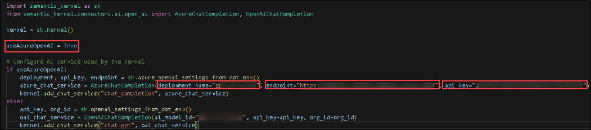
  
8. **Execute the notebook cell by cell** (using either Ctrl + Enter to stay on the same cell or Shift + Enter to advance to the next cell) and observe the **results of each cell** execution.
  
     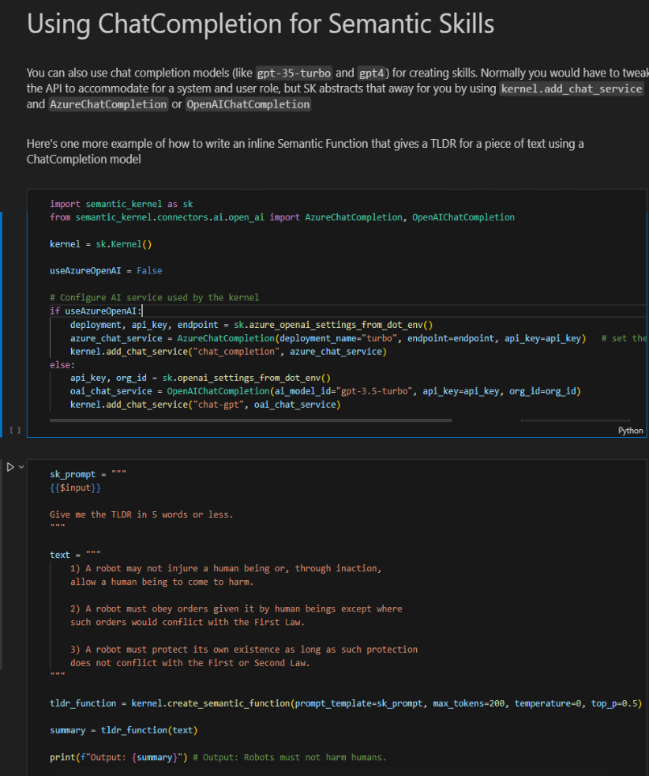
