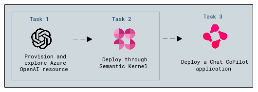
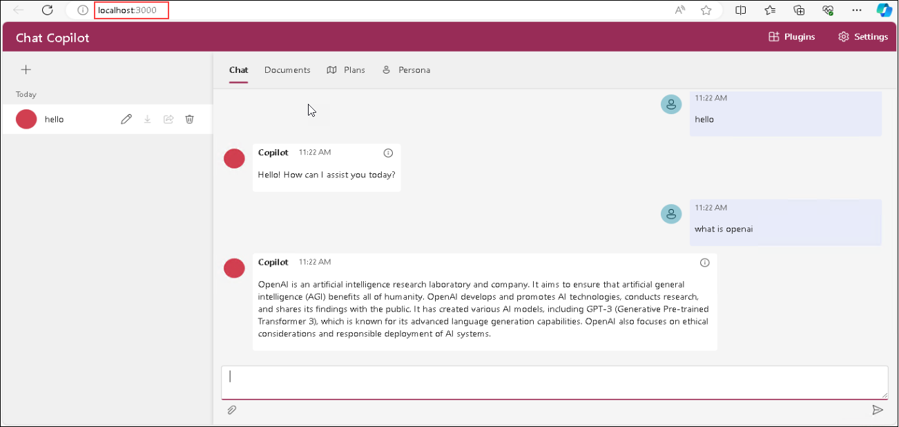

# Exercise 9C: Deploy a Chat CoPilot application based on Semantic Kernal

In this exercise, you will delve into deploying a Chat CoPilot application using Semantic Kernel, a powerful fusion of Azure OpenAI, OpenAI, and Hugging Face services.

## Lab Scenario
Contoso is exploring advanced AI integration for its development team. In this scenario, they aim to deploy a Chat CoPilot application using Semantic Kernel, seamlessly combining Azure OpenAI, OpenAI, and Hugging Face services. 

## Lab Objectives

In this exercise, you will perform the following:
- Deploy a Chat CoPilot application using Semantic Kernel.
- Configure both backend and frontend components for a collaborative coding environment.

## Architecture Diagram

   

## Task 1: Deployment of Chat CoPilot application

1. In the LabVM, click on **Start**, from the start menu search and select for **PowerShell 7**. 

1. Run the following command to change the path.

   ```
   cd C:\LabFiles\chat-copilot\scripts
   ```

1. Run the following to set the execution policy.

   ```
   Set-ExecutionPolicy -ExecutionPolicy Unrestricted -Scope Process
   ``` 

1. The execution policy helps protect you from scripts that you do not trust. Changing the execution policy might expose you to the security risks described in the about_Execution_Policies help topic. Do you want to change the execution policy?, enter **A** and hit **Enter**.

1. Configure Chat Copilot by running the following command.

   ```powershell
   .\Configure.ps1 -AIService AzureOpenAI -APIKey {API_KEY} -Endpoint {AZURE_OPENAI_ENDPOINT} -CompletionModel {CompletionModel_NAME} -EmbeddingModel {EmbeddingModel_NAME}
   ```

   - `API_KEY`: The `API key` for Azure OpenAI or OpenAI.
   - `AZURE_OPENAI_ENDPOINT`: The Azure OpenAI resource `Endpoint` address. Omit `-Endpoint` if using OpenAI.
   - `{CompletionModel_NAME}`: Deployment name of the `gpt-35-turbo-16k` model.
   - `{EmbeddingModel_NAME}`:  Deployment name of the `text-embedding-ada-002` model.
   - Execution will take 2 to 3 minutes.

1. Run Chat Copilot locally. This step starts the **backend API** application. frontend

   ```powershell
   .\Start-Backend.ps1
   ```
   
   > **Note:** It may take a few minutes for Yarn packages to install on the first run.

1. Open another tab in **Edge**, in the browser window paste the following link, you should see a confirmation message: `Healthy`.

   ```powershell
   http://localhost:40443/healthz
   ```
  
   > **Note:** Don't close the powershell window keep it running up.

1. In the LabVM, click on **Start**, from the start menu search and select for **PowerShell 7**. 

1. Run the following command to change the path.

   ```
   cd C:\LabFiles\chat-copilot\scripts
   ```

1. Run the following to set the execution policy.

   ```
   Set-ExecutionPolicy -ExecutionPolicy Unrestricted -Scope Process
   ``` 

1. The execution policy helps protect you from scripts that you do not trust. Changing the execution policy might expose you to the security risks described in the about_Execution_Policies help topic. Do you want to change the execution policy?, enter **A** and hit **Enter**.

1. Configure **Chat Copilot** by running the following command.

   ```powershell
   .\Start-Frontend.ps1
   ```

   > **Note:** It may take a few minutes for Yarn packages to install on the first run.

1. Once the deployment of script is executed succeddedfully it will redirect to `http://localhost:3000/` Chat CoPilot in **Edge** browser.

      

1. Now **Chat Copilot** application is ready to use you can ask any question Chat Copilot will response accoundingly.

      

    > **Congratulations** on completing the task! Now, it's time to validate it. Here are the steps:
      > - Navigate to the Lab Validation tab, from the upper right corner in the lab guide section.
      > - Hit the Validate button for the corresponding task. If you receive a success message, you can proceed to the next task. 
      > - If not, carefully read the error message and retry the step, following the instructions in the lab guide.
      > - If you need any assistance, please contact us at labs-support@spektrasystems.com.

## Review
In this exercise you have accomplished the following:
- Successfully configured and deployed Chat CoPilot application using Semantic Kernel.
- Demonstrated effective integration of Azure OpenAI and Chat CoPilot for collaborative coding.

## You have successfully completed the lab


