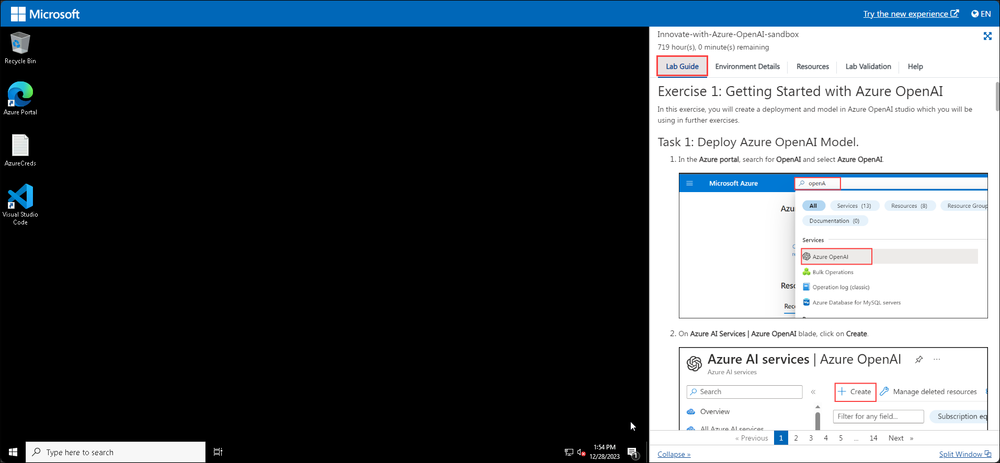
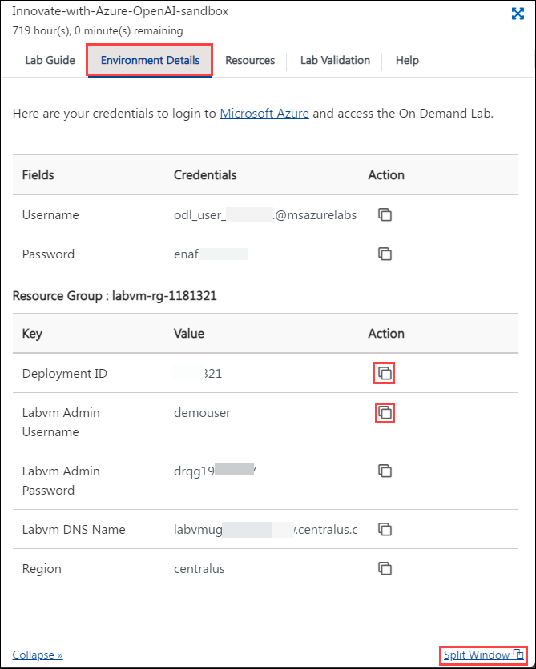
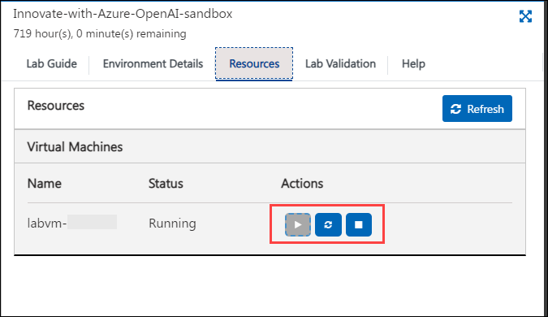
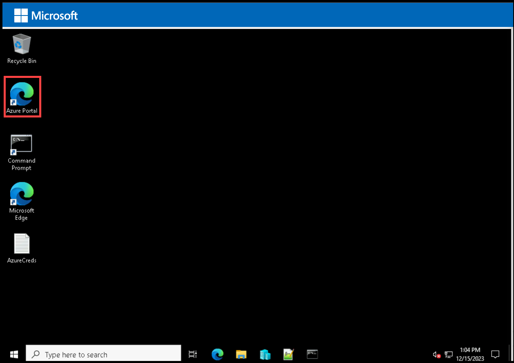
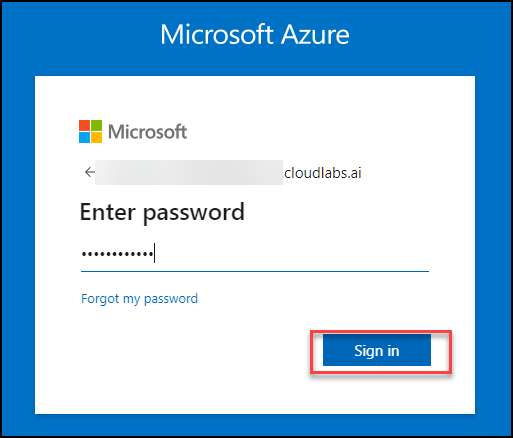
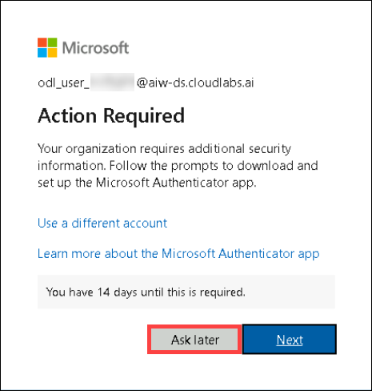

# Getting Started with the Lab

1. After the environment has been set up, your browser will load a virtual machine (JumpVM), use this virtual machine throughout the workshop to perform the lab. You can see the number on the bottom of the lab guide to switch to different exercises in the lab guide.

   
 
1. To get the lab environment details, you can select the **Environment Details** tab. Additionally, the credentials will also be emailed to your registered email address. You can also open the Lab Guide in a separate and full window by selecting the **Split Window** from the lower right corner. 

    

1. You can start, stop, and restart virtual machines from the **Resources** tab.

   

1. Click "Next" from the bottom right corner to embark on your Lab journey!
 
   .png)

## Login to Azure Portal
1. In the JumpVM, click on Azure portal shortcut of Microsoft Edge browser which is created on desktop.

     
   
1. On **Sign into Microsoft Azure** tab you will see login screen, in that enter following email/username and then click on **Next**. 
   * Email/Username: <inject key="AzureAdUserEmail"></inject>
   
     

     > **Note:** If you get a **Download Microsoft Edge mobile app** popup, then click on **Do not show** dropdown and select **Don't show this recommendation again**. 
     
1. Now enter the following password and click on **Sign in**.
   * Password: <inject key="AzureAdUserPassword"></inject>
   
     
     
   > If you are presented with **Help us protect your account** dialog box, then select **Skip for now** option.

      

   > If you are presented with **Action Required** dialog box, then select **Ask later** option.

      
  
1. If you see the pop-up **Stay Signed in?**, click No

1. If you see the pop-up **You have free Azure Advisor recommendations!**, close the window to continue the lab.

1. If a **Welcome to Microsoft Azure** popup window appears, click **Maybe Later** to skip the tour.
